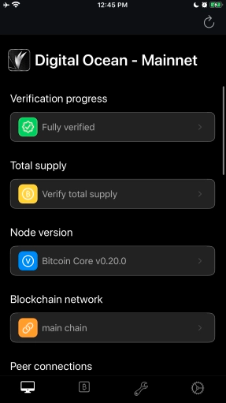
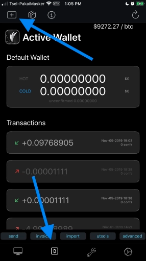
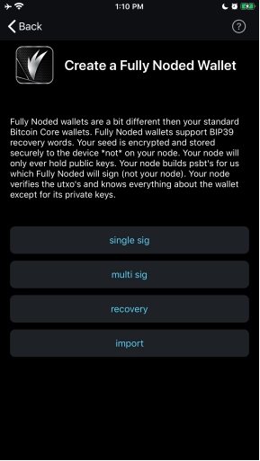

# Creating Wallets

Originated from [site](https://fullynoded.app/faq/#How-Do-I-Create-a-Wallet)

## How do I create a wallet?

First ensure your connection to your node is alive by allowing the home screen to completely load, you know it has finished when the spinner disappears and it looks like this:  

Then tap the “Active Wallet” tab button on the bottom tab bar, then tap the “Create a Fully Noded Wallet” button in the form of a plus sign in the top left of the “Active Wallet” view:

 

You can then either choose a single signature, multi signature, recovery or import.