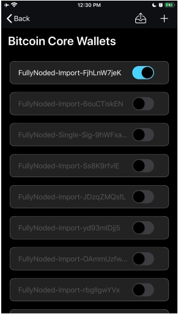

# Deleting Wallets

There are differences in *Fully Noded Wallets* versus *Bitcoin Core Wallets* 
Text below is partly originated from [website](https://fullynoded.app/faq/#How-Do-I-Delete-a-Wallet).

## There are two fundamental wallet types you can access in Fully Noded:

1. Fully Noded Wallet
2. Bitcoin Core Wallet

### A “Fully Noded Wallet”
A “Fully Noded Wallet” is a wallet you create from this screen: 

Creating a Fully Noded wallet allows the app to remember important things about your wallet which enables more functionality. You may delete these wallets from the device by tapping the info button from the “active wallet” tab and tapping the trash can.

#### Bitcoin Core Wallets
“Bitcoin Core Wallets” are any wallet that exists on your node, you can create wallets on your node with Bitcoin Core itself and a number of other apps, including Join Market, Electrum, Specter and many more. One of the great things about Fully Noded is it allows you to access all of these wallets incase you need to, allowing you to spend from them if they are hot or by adding a bip39 seed words to FN.

For every single wallet you create there is always what is called a `wallet.dat` file on your node. This can *never* be deleted from Fully Noded!

It has to be deleted *from your node*, because that is where the wallet exists.

Fully Noded is a remote control for your node and accessing “Bitcoin Core Wallets” in Fully Noded via the advanced tab simply shows you what is on your node.

To permanently delete a “Bitcoin Core Wallet” you must do so on your node via accessing the .bitcoin directory finding the wallet and manually deleting it. The same goes for “Fully Noded Wallets” as deleting them in the app simply hides them, to actually delete it you need to delete the corresponding wallet.dat file, FN conveniently displays this filename for you so you may easily identify it on your node and then delete.

## Further explanation

You can not completely delete a *Bitcoin Core Wallet* from the Fully Noded app, you must do it on your node.

For *Fully Noded Wallets* you can delete the apps database for the wallet by tapping the "trash" button from the "Wallet Detail" view which will cause the app to forget about the wallet, however it can still be accessed as a *Bitcoin Core Wallet* by tapping `advanced` > `Bitcoin Core Wallets`.

To delete the `Bitcoin Core Wallet` you need to navigate to your nodes wallets directory which can generally be found in your Bitcoin Core's default data directory:
* Linux: `~/.bitcoin/wallets`
* macOS: `~/Library/Application Support/Bitcoin/wallets`
* Windows: `%APPDATA%\Bitcoin\wallets`

  

You can cross reference *Fully Noded Wallets* by tapping the "info" button from the "Active Wallet" tab and looking for the `Filename` field.

  

You can cross reference *Bitcoin Core Wallets* filenames by navigating to `advanced` > `Bitcoin Core Wallets`, the text you see is the wallets filename.
